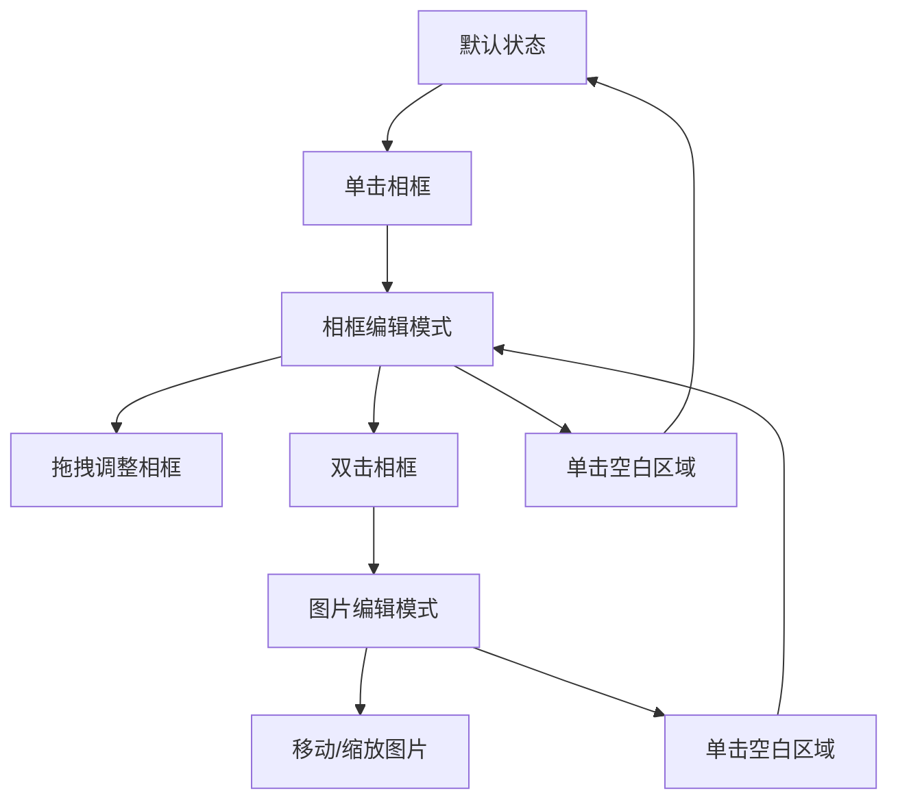

# 🎨 相框交互功能需求文档

## 1. 产品概述

本功能实现了一个创新的双模式相框编辑系统，用户可以通过单击和双击相框实现两种不同的编辑模式。相框作为遮罩（Mask）控制图片的显示区域，相框与图片为独立层级，交互行为根据当前编辑状态自动切换。

### 核心目标
- 提供直观的相框编辑体验
- 支持精确的相框和图片分别编辑
- 确保交互逻辑清晰，避免误操作
- 保持编辑过程的视觉反馈和状态提示

## 2. 核心功能

### 2.1 功能模块

我们的相框交互功能由以下核心模块组成：

1. **相框创建模块** - 创建圆形/矩形相框
2. **双模式编辑模块** - 单击编辑相框，双击编辑图片
3. **状态管理模块** - 管理当前编辑状态和模式切换
4. **视觉反馈模块** - 提供选中高亮、半透明效果等
5. **撤销重做模块** - 支持Ctrl+Z撤销操作

### 2.2 用户角色

| 角色 | 权限 | 功能访问 |
|------|------|----------|
| 普通用户 | 默认权限 | 创建相框、导入图片、编辑相框和图片 |
| 高级用户 | 完整权限 | 所有编辑功能、高级设置 |

## 3. 功能详细说明

### 3.1 模式一：相框编辑模式（单击触发）

#### 🎯 功能目标
用户可以通过拖拽相框边缘调整相框大小、形状、比例，改变遮罩的显示区域。

#### 🧭 交互逻辑

| 项目 | 详细说明 |
|------|----------|
| **触发方式** | 单击选中相框（显示高亮状态） |
| **可交互元素** | 相框边缘和四角显示拖拽点（仅描相框边线，不描绘图片边缘） |
| **操作行为** | 拖拽边框点可改变相框宽高尺寸 |
| **变形规则** | 允许非等比缩放：例如圆形相框可被拖成长椭圆 |
| **视觉反馈** | 选中时显示细描边框线，边框半透明高亮 |
| **结果表现** | 相框形状变化后，图片不变形，仅显示区域随遮罩变化 |
| **图片响应逻辑** | 图片位置和比例保持不变；仅遮罩显示范围扩大或缩小 |

#### 💡 举例说明
如果相框由圆形变成椭圆，图片仍维持原比例，仅显示部分不同。

### 3.2 模式二：图片编辑模式（双击触发）

#### 🎯 功能目标
用户双击相框后，进入图片编辑状态，可调整图片在相框内的显示方式，包括移动与缩放。

#### 🧭 交互逻辑

| 项目 | 详细说明 |
|------|----------|
| **触发方式** | 双击相框进入图片编辑模式 |
| **相框状态** | 相框尺寸与位置锁定，不可移动或缩放 |
| **图片显示** | 相框外被遮挡的图片区域暂时可见但降低透明度（如30%透明） |
| **操作行为** | 1️⃣ 拖动图片以改变在相框内的显示位置<br>2️⃣ 拖拽图片的角点调整大小（等比缩放）<br>3️⃣ 图片可旋转 |
| **视觉反馈** | 图片外部区域半透明；相框轮廓保持高亮显示，提示当前编辑范围 |
| **退出编辑** | 单击空白区域退出图片编辑，恢复相框遮罩状态 |
| **状态切换** | 编辑完成后，重新单击回到相框编辑模式 |

## 4. 交互状态切换流程



## 5. 用户界面设计

### 5.1 设计规范

#### 颜色方案
- **主色调**: #3B82F6 (蓝色) - 用于选中状态和高亮
- **辅助色**: #10B981 (绿色) - 用于成功提示
- **警告色**: #F59E0B (橙色) - 用于重要提示
- **边框色**: rgba(100, 100, 100, 0.5) - 相框边框
- **高亮色**: rgba(59, 130, 246, 0.3) - 选中高亮

#### 视觉反馈
- **选中状态**: 2px实线边框 + 半透明填充
- **拖拽点**: 8×8px正方形，位于四角和边缘中点
- **图片外部区域**: 30%透明度，保持可见但降低对比度
- **悬停效果**: 边框颜色加深，显示操作提示

### 5.2 页面元素

| 元素类型 | 样式描述 | 交互行为 |
|----------|----------|----------|
| **相框边框** | 2px虚线，rgba(100,100,100,0.5) | 单击选中，显示拖拽点 |
| **选中边框** | 2px实线，#3B82F6，半透明填充 | 显示拖拽手柄 |
| **拖拽手柄** | 8×8px正方形，蓝色边框 | 拖拽调整尺寸 |
| **图片外部** | 30%透明度，降低对比度 | 双击进入图片编辑模式 |
| **操作提示** | 12px字体，灰色文字 | 显示当前模式提示 |

## 6. 技术实现要点

### 6.1 组合对象管理
- 相框与图片作为独立对象存在
- 使用组合(Group)或层级关系管理
- 状态切换时锁定/解锁相应对象

### 6.2 事件监听系统
```typescript
// 单击事件 - 进入相框编辑模式
canvas.on('selection:created', handleFrameSelection);

// 双击事件 - 进入图片编辑模式  
canvas.on('mouse:dblclick', handleImageEditMode);

// 空白区域点击 - 退出编辑模式
canvas.on('selection:cleared', exitEditMode);
```

### 6.3 状态管理
```typescript
interface EditState {
  mode: 'frame' | 'image' | 'none';  // 当前编辑模式
  selectedObject: fabric.Object | null;  // 选中对象
  isEditing: boolean;  // 是否处于编辑状态
  originalState: any;  // 用于撤销的原状态
}
```

### 6.4 撤销功能实现
- 使用命令模式记录每个操作
- 支持Ctrl+Z快捷键撤销
- 维护操作历史栈
- 状态变化时自动保存快照

### 6.5 视觉反馈系统
- 选中状态：边框高亮 + 拖拽手柄显示
- 编辑模式：相框/图片不同高亮样式
- 操作提示：显示当前模式和可用操作
- 错误处理：无效操作时的友好提示

## 7. 性能优化

### 7.1 渲染优化
- 使用对象缓存减少重绘
- 拖拽过程中使用低分辨率预览
- 操作完成后恢复高质量渲染

### 7.2 内存管理
- 及时清理未使用的对象引用
- 图片编辑模式切换时优化内存使用
- 大尺寸图片的渐进式加载

## 8. 错误处理

### 8.1 边界情况
- 图片尺寸小于相框时的处理
- 相框尺寸调整的最小/最大限制
- 无效图片格式的错误提示

### 8.2 用户体验
- 操作过程中的加载状态提示
- 错误操作的友好提示信息
- 恢复默认设置的快捷方式

## 9. 测试场景

### 9.1 功能测试
1. 创建相框并导入不同尺寸图片
2. 测试单击进入相框编辑模式
3. 测试双击进入图片编辑模式
4. 验证拖拽调整相框尺寸
5. 验证图片移动和缩放操作
6. 测试状态切换和退出编辑

### 9.2 兼容性测试
- 不同浏览器（Chrome, Firefox, Safari）
- 不同设备（桌面端、移动端）
- 不同图片格式（JPG, PNG, WebP）

### 9.3 性能测试
- 大尺寸图片的加载和编辑性能
- 多相框同时编辑的响应速度
- 撤销重做功能的性能表现

## 10. 后续扩展

### 10.1 功能增强
- 支持更多相框形状（星形、心形等）
- 添加相框样式（边框、阴影、装饰）
- 支持多图片层叠和混合模式

### 10.2 高级功能
- 智能图片裁剪建议
- AI辅助的图片位置优化
- 批量编辑和模板应用

---

本需求文档详细描述了相框交互功能的完整实现方案，确保开发团队能够准确理解和实现这个复杂的双模式编辑系统。