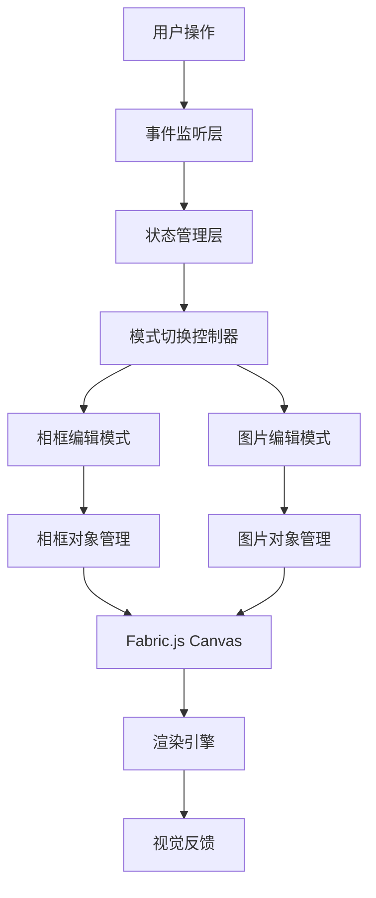

# 🎨 相框交互功能技术架构文档

## 1. 架构设计



## 2. 技术栈

### 前端技术
- **框架**: React@18 + TypeScript
- **画布引擎**: Fabric.js@5.3.0
- **样式**: TailwindCSS@3 + 自定义CSS
- **状态管理**: React Hooks + Context API
- **构建工具**: Vite@5

### 初始化工具
- **项目初始化**: vite-init

### 后端技术
- **无后端依赖**: 纯前端实现，使用浏览器本地存储

## 3. 核心组件架构

### 3.1 CanvasEditor 组件结构

```typescript
interface CanvasEditorProps {
  width: number;
  height: number;
  ref: React.Ref<CanvasEditorRef>;
}

interface CanvasEditorRef {
  // 相框相关方法
  addCircleFrame: () => void;
  addRectFrame: () => void;
  uploadImageToFrame: (frame: fabric.Object, imageUrl: string) => void;
  
  // 通用编辑方法
  getCanvas: () => fabric.Canvas | null;
  deleteSelected: () => void;
  exportCanvas: () => string;
  
  // 图层管理
  bringToFront: () => void;
  sendToBack: () => void;
  bringForward: () => void;
  sendBackwards: () => void;
}
```

### 3.2 状态管理架构

```typescript
interface FrameEditorState {
  // 编辑模式
  editMode: 'none' | 'frame' | 'image';
  
  // 当前选中对象
  selectedObject: fabric.Object | null;
  frameGroup: fabric.Group | null;
  
  // 相框状态
  frameObject: fabric.Object | null;
  frameType: 'circle' | 'rect' | null;
  
  // 图片状态
  imageObject: fabric.Image | null;
  originalImageSize: { width: number; height: number };
  
  // 编辑历史
  history: EditAction[];
  historyIndex: number;
  
  // 视觉状态
  isDragging: boolean;
  showImageOutline: boolean;
}

interface EditAction {
  type: 'transform' | 'move' | 'scale' | 'rotate';
  objectType: 'frame' | 'image';
  before: any;
  after: any;
  timestamp: number;
}
```

## 4. 事件处理系统

### 4.1 事件监听器配置

```typescript
// Canvas 事件监听
const setupCanvasEvents = (canvas: fabric.Canvas) => {
  // 选择事件
  canvas.on('selection:created', handleSelectionCreated);
  canvas.on('selection:updated', handleSelectionUpdated);
  canvas.on('selection:cleared', handleSelectionCleared);
  
  // 鼠标事件
  canvas.on('mouse:down', handleMouseDown);
  canvas.on('mouse:move', handleMouseMove);
  canvas.on('mouse:up', handleMouseUp);
  canvas.on('mouse:dblclick', handleDoubleClick);
  
  // 对象变换事件
  canvas.on('object:modified', handleObjectModified);
  canvas.on('object:scaling', handleObjectScaling);
  canvas.on('object:moving', handleObjectMoving);
  
  // 键盘事件
  canvas.on('key:ctrl+z', handleUndo);
  canvas.on('key:ctrl+y', handleRedo);
};
```

### 4.2 事件处理函数

```typescript
// 选择创建事件
const handleSelectionCreated = (event: fabric.IEvent) => {
  const object = event.target;
  
  if (isFrameObject(object)) {
    enterFrameEditMode(object);
  } else if (isImageObject(object)) {
    enterImageEditMode(object);
  }
};

// 双击事件处理
const handleDoubleClick = (event: fabric.IEvent) => {
  const target = event.target;
  
  if (isFrameObject(target) && state.editMode === 'frame') {
    // 切换到图片编辑模式
    const image = getImageInFrame(target);
    if (image) {
      enterImageEditMode(image);
    }
  }
};
```

## 5. 编辑模式实现

### 5.1 相框编辑模式

```typescript
class FrameEditMode {
  private canvas: fabric.Canvas;
  private frame: fabric.Object;
  private originalState: any;
  
  constructor(canvas: fabric.Canvas, frame: fabric.Object) {
    this.canvas = canvas;
    this.frame = frame;
    this.saveOriginalState();
    this.setupFrameControls();
  }
  
  private setupFrameControls() {
    // 启用相框的变换控制
    this.frame.set({
      hasControls: true,
      hasBorders: true,
      lockMovementX: false,
      lockMovementY: false,
      lockScalingX: false,
      lockScalingY: false,
      lockRotation: false,
    });
    
    // 禁用图片的变换
    const image = this.getAssociatedImage();
    if (image) {
      image.set({
        hasControls: false,
        hasBorders: false,
        selectable: false,
      });
    }
    
    // 设置控制点样式
    this.frame.setControlsVisibility({
      mt: true,  // 上边中点
      mb: true,  // 下边中点
      ml: true,  // 左边中点
      mr: true,  // 右边中点
      tl: true,  // 左上角
      tr: true,  // 右上角
      bl: true,  // 左下角
      br: true,  // 右下角
      mtr: true, // 旋转点
    });
  }
  
  private handleFrameTransform() {
    // 更新相框形状时，同步更新图片裁剪路径
    const image = this.getAssociatedImage();
    if (image && image.clipPath) {
      this.updateClipPath(image.clipPath);
    }
  }
}
```

### 5.2 图片编辑模式

```typescript
class ImageEditMode {
  private canvas: fabric.Canvas;
  private image: fabric.Image;
  private frame: fabric.Object;
  private originalState: any;
  
  constructor(canvas: fabric.Canvas, image: fabric.Image, frame: fabric.Object) {
    this.canvas = canvas;
    this.image = image;
    this.frame = frame;
    this.saveOriginalState();
    this.setupImageControls();
    this.showImageOutline();
  }
  
  private setupImageControls() {
    // 锁定相框
    this.frame.set({
      hasControls: false,
      hasBorders: true,
      lockMovementX: true,
      lockMovementY: true,
      lockScalingX: true,
      lockScalingY: true,
      lockRotation: true,
    });
    
    // 启用图片变换
    this.image.set({
      hasControls: true,
      hasBorders: true,
      selectable: true,
      lockMovementX: false,
      lockMovementY: false,
      lockScalingX: false,
      lockScalingY: false,
      lockRotation: false,
    });
    
    // 设置等比缩放
    this.image.setControlsVisibility({
      mt: false, // 禁用非等比缩放
      mb: false,
      ml: false,
      mr: false,
      tl: true,  // 仅允许角点等比缩放
      tr: true,
      bl: true,
      br: true,
      mtr: true, // 允许旋转
    });
  }
  
  private showImageOutline() {
    // 显示图片外部区域（半透明）
    const imageBounds = this.image.getBoundingRect();
    const frameBounds = this.frame.getBoundingRect();
    
    // 创建半透明遮罩显示图片外部区域
    const outline = new fabric.Rect({
      left: imageBounds.left,
      top: imageBounds.top,
      width: imageBounds.width,
      height: imageBounds.height,
      fill: 'rgba(0, 0, 0, 0.3)',
      stroke: 'rgba(59, 130, 246, 0.8)',
      strokeWidth: 2,
      strokeDashArray: [5, 5],
      selectable: false,
      evented: false,
    });
    
    this.canvas.add(outline);
    this.image.outline = outline;
    this.canvas.renderAll();
  }
}
```

## 6. 裁剪路径管理

### 6.1 动态裁剪路径更新

```typescript
// 更新相框裁剪路径
const updateFrameClipPath = (frame: fabric.Object, image: fabric.Image) => {
  const frameType = (frame as any)._frameType;
  
  if (frameType === 'circle') {
    const radius = (frame as any)._frameRadius * frame.scaleX;
    const centerX = frame.left || 0;
    const centerY = frame.top || 0;
    
    const clipPath = new fabric.Circle({
      radius: radius,
      left: centerX,
      top: centerY,
      originX: 'center',
      originY: 'center',
      absolutePositioned: true,
    });
    
    image.clipPath = clipPath;
  } else if (frameType === 'rect') {
    const width = (frame as any)._frameWidth * frame.scaleX;
    const height = (frame as any)._frameHeight * frame.scaleY;
    const left = (frame.left || 0) - width / 2;
    const top = (frame.top || 0) - height / 2;
    
    const clipPath = new fabric.Rect({
      left: left,
      top: top,
      width: width,
      height: height,
      absolutePositioned: true,
    });
    
    image.clipPath = clipPath;
  }
};
```

### 6.2 裁剪路径同步

```typescript
// 相框变换时同步更新裁剪路径
const syncClipPathOnTransform = (frame: fabric.Object) => {
  const image = getImageInFrame(frame);
  if (image) {
    updateFrameClipPath(frame, image);
    canvas.renderAll();
  }
};
```

## 7. 撤销重做系统

### 7.1 命令模式实现

```typescript
// 命令接口
interface Command {
  execute(): void;
  undo(): void;
  getDescription(): string;
}

// 相框变换命令
class FrameTransformCommand implements Command {
  constructor(
    private frame: fabric.Object,
    private oldState: any,
    private newState: any
  ) {}
  
  execute(): void {
    this.frame.set(this.newState);
    this.frame.canvas?.renderAll();
  }
  
  undo(): void {
    this.frame.set(this.oldState);
    syncClipPathOnTransform(this.frame);
    this.frame.canvas?.renderAll();
  }
  
  getDescription(): string {
    return 'Transform frame';
  }
}

// 图片变换命令
class ImageTransformCommand implements Command {
  constructor(
    private image: fabric.Image,
    private oldState: any,
    private newState: any
  ) {}
  
  execute(): void {
    this.image.set(this.newState);
    this.image.canvas?.renderAll();
  }
  
  undo(): void {
    this.image.set(this.oldState);
    this.image.canvas?.renderAll();
  }
  
  getDescription(): string {
    return 'Transform image';
  }
}
```

### 7.2 历史管理器

```typescript
class HistoryManager {
  private commands: Command[] = [];
  private currentIndex = -1;
  private maxHistory = 50;
  
  executeCommand(command: Command): void {
    // 清除当前索引之后的命令
    this.commands = this.commands.slice(0, this.currentIndex + 1);
    
    // 执行新命令
    command.execute();
    this.commands.push(command);
    this.currentIndex++;
    
    // 限制历史记录数量
    if (this.commands.length > this.maxHistory) {
      this.commands.shift();
      this.currentIndex--;
    }
  }
  
  undo(): void {
    if (this.currentIndex >= 0) {
      this.commands[this.currentIndex].undo();
      this.currentIndex--;
    }
  }
  
  redo(): void {
    if (this.currentIndex < this.commands.length - 1) {
      this.currentIndex++;
      this.commands[this.currentIndex].execute();
    }
  }
  
  canUndo(): boolean {
    return this.currentIndex >= 0;
  }
  
  canRedo(): boolean {
    return this.currentIndex < this.commands.length - 1;
  }
}
```

## 8. 性能优化策略

### 8.1 渲染优化

```typescript
// 批量渲染优化
const batchRender = (() => {
  let rafId: number | null = null;
  
  return (canvas: fabric.Canvas) => {
    if (rafId) {
      cancelAnimationFrame(rafId);
    }
    
    rafId = requestAnimationFrame(() => {
      canvas.renderAll();
      rafId = null;
    });
  };
})();

// 拖拽过程中的低分辨率渲染
const enableLowResRendering = (canvas: fabric.Canvas) => {
  canvas.on('object:scaling', () => {
    canvas.renderOnAddRemove = false;
    canvas.selection = false;
  });
  
  canvas.on('object:scaled', () => {
    canvas.renderOnAddRemove = true;
    canvas.selection = true;
    canvas.renderAll();
  });
};
```

### 8.2 内存管理

```typescript
// 对象清理
const cleanupObject = (obj: fabric.Object) => {
  if (obj.clipPath) {
    obj.clipPath = null;
  }
  
  if (obj.outline) {
    obj.canvas?.remove(obj.outline);
    obj.outline = null;
  }
  
  obj.off(); // 移除所有事件监听
};

// 画布清理
const cleanupCanvas = (canvas: fabric.Canvas) => {
  canvas.getObjects().forEach(obj => {
    cleanupObject(obj);
  });
  
  canvas.clear();
  canvas.dispose();
};
```

## 9. 错误处理机制

### 9.1 边界检查

```typescript
// 相框尺寸限制
const validateFrameSize = (frame: fabric.Object) => {
  const minSize = 20;
  const maxSize = 1000;
  
  const currentWidth = (frame.width || 0) * (frame.scaleX || 1);
  const currentHeight = (frame.height || 0) * (frame.scaleY || 1);
  
  if (currentWidth < minSize || currentHeight < minSize) {
    // 恢复到最小尺寸
    const scale = minSize / Math.max(frame.width || 1, frame.height || 1);
    frame.set({ scaleX: scale, scaleY: scale });
  }
  
  if (currentWidth > maxSize || currentHeight > maxSize) {
    // 恢复到最大尺寸
    const scale = maxSize / Math.max(frame.width || 1, frame.height || 1);
    frame.set({ scaleX: scale, scaleY: scale });
  }
};
```

### 9.2 异常处理

```typescript
// 图片加载错误处理
const handleImageLoadError = (error: any) => {
  console.error('Image load failed:', error);
  
  // 显示用户友好的错误提示
  showNotification({
    type: 'error',
    message: '图片加载失败，请检查图片格式和大小',
    duration: 3000,
  });
  
  // 回滚到上一个有效状态
  historyManager.undo();
};

// 相框创建错误处理
const handleFrameCreationError = (error: any) => {
  console.error('Frame creation failed:', error);
  
  showNotification({
    type: 'error',
    message: '相框创建失败，请重试',
    duration: 3000,
  });
};
```

## 10. 测试策略

### 10.1 单元测试

```typescript
// 相框编辑模式测试
describe('FrameEditMode', () => {
  it('should enable frame controls and disable image controls', () => {
    const mode = new FrameEditMode(canvas, frame);
    
    expect(frame.hasControls).toBe(true);
    expect(frame.selectable).toBe(true);
    expect(image.hasControls).toBe(false);
    expect(image.selectable).toBe(false);
  });
  
  it('should update clip path when frame is transformed', () => {
    const spy = jest.spyOn(clipPathUtils, 'updateFrameClipPath');
    
    frame.set({ scaleX: 2 });
    mode.handleFrameTransform();
    
    expect(spy).toHaveBeenCalledWith(frame, image);
  });
});
```

### 10.2 集成测试

```typescript
// 双模式切换测试
describe('Edit Mode Switching', () => {
  it('should switch from frame mode to image mode on double click', () => {
    // 进入相框编辑模式
    canvas.fire('selection:created', { target: frame });
    expect(state.editMode).toBe('frame');
    
    // 双击切换到图片编辑模式
    canvas.fire('mouse:dblclick', { target: frame });
    expect(state.editMode).toBe('image');
  });
  
  it('should exit image mode when clicking empty area', () => {
    // 进入图片编辑模式
    enterImageEditMode(image);
    expect(state.editMode).toBe('image');
    
    // 点击空白区域
    canvas.fire('selection:cleared');
    expect(state.editMode).toBe('none');
  });
});
```

## 11. 部署和监控

### 11.1 性能监控

```typescript
// 性能指标收集
const performanceMonitor = {
  startTime: 0,
  
  startOperation(operation: string) {
    this.startTime = performance.now();
    console.log(`Starting ${operation}`);
  },
  
  endOperation(operation: string) {
    const duration = performance.now() - this.startTime;
    console.log(`${operation} completed in ${duration}ms`);
    
    // 发送到监控系统
    if (duration > 100) {
      reportPerformanceMetric(operation, duration);
    }
  },
};
```

### 11.2 错误监控

```typescript
// 全局错误处理
window.addEventListener('error', (event) => {
  console.error('Global error:', event.error);
  
  // 发送到错误监控系统
  reportError({
    message: event.error.message,
    stack: event.error.stack,
    filename: event.filename,
    lineno: event.lineno,
    colno: event.colno,
  });
});

// Promise 拒绝处理
window.addEventListener('unhandledrejection', (event) => {
  console.error('Unhandled promise rejection:', event.reason);
  
  reportError({
    message: 'Promise rejection',
    reason: event.reason,
  });
});
```

---

本技术架构文档详细描述了相框交互功能的技术实现方案，包括状态管理、事件处理、编辑模式切换、性能优化等关键技术点，为开发团队提供了完整的技术指导。