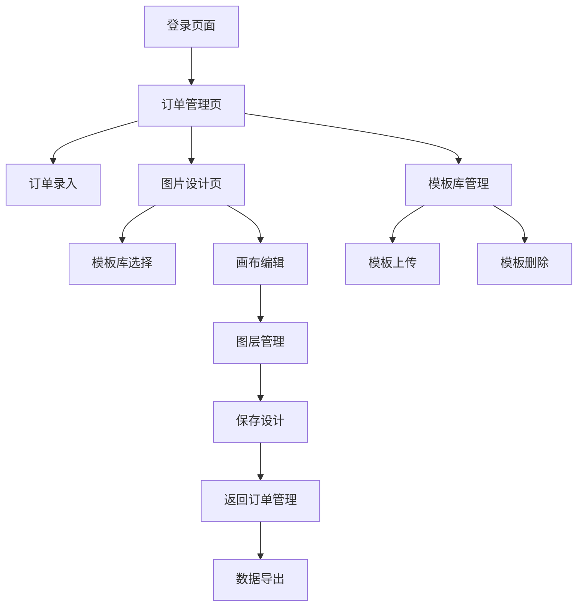

## 1. 产品概述
一个集订单导入、图片设计和数据导出于一体的工具网站。主要解决抱枕定制商家的订单管理和个性化图片设计需求，帮助商家高效处理订单信息和设计定制化产品图片。

目标用户为抱枕定制商家，通过系统化的订单管理和可视化图片设计工具，提升订单处理效率和产品定制化水平。

## 2. 核心功能

### 2.1 用户角色
| 角色 | 注册方式 | 核心权限 |
|------|----------|----------|
| 管理员 | 邮箱注册 | 订单管理、模板库管理、图片设计、数据导出 |
| 设计师 | 管理员邀请 | 图片设计、模板管理 |

### 2.2 功能模块
系统主要包含以下核心页面：
1. **订单管理页**：订单列表展示、订单录入、订单编辑
2. **图片设计页**：模板选择、画布编辑、图层管理、图片保存
3. **模板库管理页**：模板上传、模板删除、模板分类管理
4. **数据导出页**：订单信息导出、设计图批量导出

### 2.3 页面详情
| 页面名称 | 模块名称 | 功能描述 |
|----------|----------|----------|
| 订单管理页 | 订单列表 | 展示所有订单，包含订单号、收货地址、产品尺寸、状态、创建时间 |
| 订单管理页 | 订单录入 | 输入订单号、收货地址、产品尺寸（长×宽×高），支持批量导入 |
| 订单管理页 | 订单操作 | 查看详情、进入设计、编辑订单、删除订单 |
| 图片设计页 | 模板库 | 展示所有可用模板，支持分类筛选，点击选择模板到画布 |
| 图片设计页 | 画布编辑 | 支持拖拽模板到画布，添加新图片，调整图片大小和位置 |
| 图片设计页 | 形状编辑 | 图片可转换为圆形，圆形边缘支持拖拽成不规则形状 |
| 图片设计页 | 图层管理 | 显示所有图层，支持图层上下移动、隐藏/显示、删除 |
| 图片设计页 | 图片保存 | 保存当前设计到对应订单，支持预览和重新编辑 |
| 模板库管理页 | 模板上传 | 支持上传图片文件作为模板，设置模板名称和分类 |
| 模板库管理页 | 模板操作 | 删除模板、编辑模板信息、设置模板分类 |
| 数据导出页 | 订单导出 | 导出订单信息为Excel/CSV格式，支持筛选条件导出 |
| 数据导出页 | 图片导出 | 批量导出订单对应的设计图片，支持选择图片格式 |

## 3. 核心流程

### 管理员流程
1. 登录系统进入订单管理页面
2. 录入新订单信息（订单号、收货地址、产品尺寸）
3. 点击订单"进入设计"按钮跳转到图片设计页面
4. 在模板库中选择合适模板添加到画布
5. 在画布中编辑图片：调整大小、修改形状、添加新图片
6. 使用图层管理功能调整元素层级关系
7. 完成设计后点击保存，设计图关联到当前订单
8. 在订单列表中可以查看和导出订单信息及设计图

### 模板管理流程
1. 进入模板库管理页面
2. 上传新的模板图片，设置模板名称和分类
3. 管理现有模板：删除不需要的模板、编辑模板信息
4. 模板在设计页面实时生效

## 4. 用户界面设计

### 4.1 设计风格
- **主色调**：蓝色系（#1890ff）为主，白色背景
- **按钮样式**：圆角矩形，主要操作为实心按钮，次要操作为边框按钮
- **字体**：系统默认字体，标题16px，正文14px，小字12px
- **布局风格**：左侧导航+右侧内容区域，卡片式布局展示内容
- **图标风格**：使用简洁的线性图标，统一图标库

### 4.2 页面设计概述
| 页面名称 | 模块名称 | UI元素 |
|----------|----------|--------|
| 订单管理页 | 订单列表 | 表格形式展示，包含搜索框和筛选器，每行显示订单基本信息和操作按钮 |
| 订单管理页 | 订单录入 | 弹出式表单，包含订单号、地址、尺寸输入框，支持批量导入按钮 |
| 图片设计页 | 模板库 | 左侧边栏展示，网格布局显示模板缩略图，支持分类筛选 |
| 图片设计页 | 画布区域 | 中央主要区域，白色背景画布，支持拖拽和缩放操作 |
| 图片设计页 | 图层管理 | 右侧面板，列表形式展示所有图层，支持拖拽排序 |
| 模板库管理页 | 模板列表 | 网格布局展示模板，每个模板显示缩略图、名称和操作按钮 |

### 4.3 响应式设计
- 桌面端优先设计，支持1280px以上屏幕
- 平板端自适应，优化触摸操作体验
- 移动端支持基础浏览功能，主要操作在桌面端完成