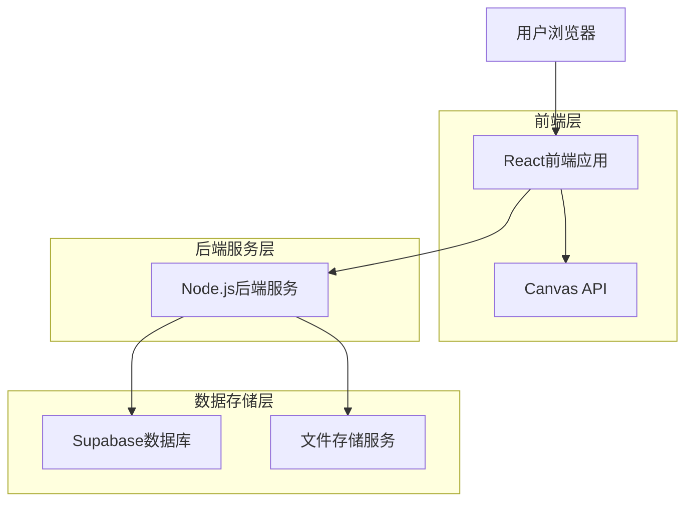
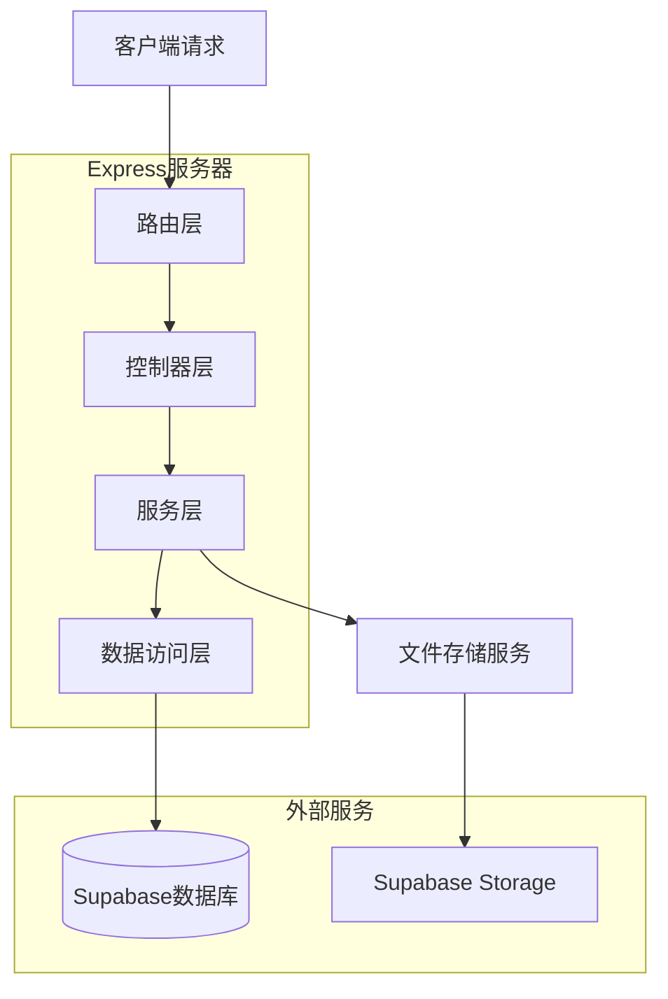
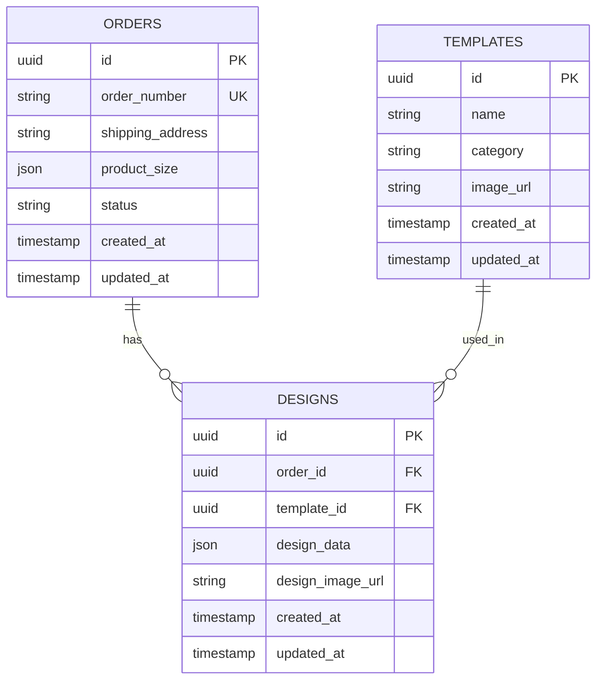

## 1. 架构设计



## 2. 技术描述

- **前端**: React@18 + TypeScript + TailwindCSS@3 + Vite
- **初始化工具**: vite-init
- **后端**: Node.js@18 + Express@4 + TypeScript
- **数据库**: Supabase (PostgreSQL)
- **文件存储**: Supabase Storage
- **Canvas库**: Fabric.js (用于图片编辑功能)

## 3. 路由定义

| 路由 | 用途 |
|------|------|
| / | 首页（订单列表） |
| /orders | 订单管理页面，展示订单列表 |
| /orders/new | 新建订单页面 |
| /orders/:id/design | 图片设计页面，针对特定订单 |
| /templates | 模板库管理页面 |
| /export | 数据导出页面 |
| /api/orders/* | 订单管理API |
| /api/templates/* | 模板管理API |
| /api/designs/* | 设计图管理API |
| /api/upload/* | 文件上传API |

## 4. API定义

### 4.1 订单管理API

**创建订单**
```
POST /api/orders
```

请求参数：
| 参数名 | 类型 | 必填 | 描述 |
|--------|------|------|------|
| order_number | string | 是 | 订单号 |
| shipping_address | string | 是 | 收货地址 |
| product_size | object | 是 | 产品尺寸 {length, width, height} |

**获取订单列表**
```
GET /api/orders?page=1&limit=10
```

**更新订单设计**
```
PUT /api/orders/:id/design
```

请求参数：
| 参数名 | 类型 | 必填 | 描述 |
|--------|------|------|------|
| design_data | object | 是 | 设计图数据（JSON格式） |
| design_image | string | 是 | 设计图片URL |

### 4.2 模板管理API

**上传模板**
```
POST /api/templates
```

请求参数：
| 参数名 | 类型 | 必填 | 描述 |
|--------|------|------|------|
| name | string | 是 | 模板名称 |
| category | string | 是 | 模板分类 |
| image | file | 是 | 模板图片文件 |

**获取模板列表**
```
GET /api/templates?category=all
```

**删除模板**
```
DELETE /api/templates/:id
```

### 4.3 文件上传API

**上传设计图片**
```
POST /api/upload/design
```

**上传模板图片**
```
POST /api/upload/template
```

## 5. 服务器架构图



## 6. 数据模型

### 6.1 数据模型定义



### 6.2 数据定义语言

**订单表 (orders)**
```sql
-- 创建订单表
CREATE TABLE orders (
    id UUID PRIMARY KEY DEFAULT gen_random_uuid(),
    order_number VARCHAR(100) UNIQUE NOT NULL,
    shipping_address TEXT NOT NULL,
    product_size JSONB NOT NULL,
    status VARCHAR(20) DEFAULT 'pending' CHECK (status IN ('pending', 'designing', 'completed', 'cancelled')),
    created_at TIMESTAMP WITH TIME ZONE DEFAULT NOW(),
    updated_at TIMESTAMP WITH TIME ZONE DEFAULT NOW()
);

-- 创建索引
CREATE INDEX idx_orders_status ON orders(status);
CREATE INDEX idx_orders_created_at ON orders(created_at DESC);
```

**模板表 (templates)**
```sql
-- 创建模板表
CREATE TABLE templates (
    id UUID PRIMARY KEY DEFAULT gen_random_uuid(),
    name VARCHAR(255) NOT NULL,
    category VARCHAR(100) NOT NULL,
    image_url TEXT NOT NULL,
    created_at TIMESTAMP WITH TIME ZONE DEFAULT NOW(),
    updated_at TIMESTAMP WITH TIME ZONE DEFAULT NOW()
);

-- 创建索引
CREATE INDEX idx_templates_category ON templates(category);
```

**设计图表 (designs)**
```sql
-- 创建设计图表
CREATE TABLE designs (
    id UUID PRIMARY KEY DEFAULT gen_random_uuid(),
    order_id UUID REFERENCES orders(id) ON DELETE CASCADE,
    template_id UUID REFERENCES templates(id) ON DELETE SET NULL,
    design_data JSONB NOT NULL,
    design_image_url TEXT NOT NULL,
    created_at TIMESTAMP WITH TIME ZONE DEFAULT NOW(),
    updated_at TIMESTAMP WITH TIME ZONE DEFAULT NOW()
);

-- 创建索引
CREATE INDEX idx_designs_order_id ON designs(order_id);
CREATE INDEX idx_designs_template_id ON designs(template_id);
CREATE INDEX idx_designs_created_at ON designs(created_at DESC);
```

**权限设置（匿名开放访问）**
```sql
-- 关闭或不启用行级安全（确保公共访问）
ALTER TABLE orders DISABLE ROW LEVEL SECURITY;
ALTER TABLE templates DISABLE ROW LEVEL SECURITY;
ALTER TABLE designs DISABLE ROW LEVEL SECURITY;

-- 向 anon 角色授予完整的读写权限（无登录）
GRANT SELECT, INSERT, UPDATE, DELETE ON orders TO anon;
GRANT SELECT, INSERT, UPDATE, DELETE ON templates TO anon;
GRANT SELECT, INSERT, UPDATE, DELETE ON designs TO anon;
```

## 7. 关键技术实现

### 7.1 Canvas图片编辑
- 使用Fabric.js库实现画布功能
- 支持图片拖拽、缩放、旋转
- 实现圆形和不规则形状编辑
- 图层管理功能

### 7.2 文件存储
- 使用Supabase Storage存储图片文件
- 支持模板图片和设计图片的上传下载
- 图片压缩和格式转换

### 7.3 数据导出
- 订单数据导出为Excel格式（使用xlsx库）
- 设计图片批量导出为ZIP格式
- 支持自定义导出筛选条件